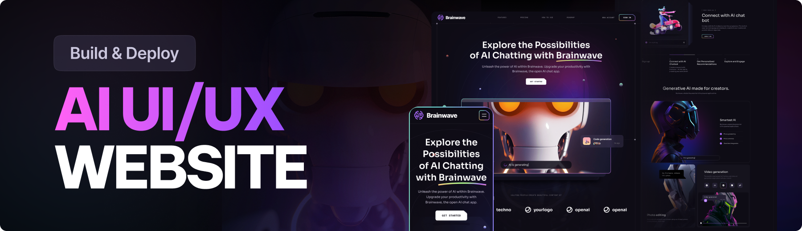

# StarForge - AI-Powered SaaS Platform

## 🚀 Transform Your Business with AI

**StarForge** is a cutting-edge AI-powered SaaS platform designed to revolutionize how businesses operate, collaborate, and grow. Our comprehensive suite of intelligent tools empowers teams to work smarter, not harder, while delivering exceptional results.

## ✨ Key Features

### 🤖 AI-Powered Intelligence
- **Smart Automation**: Automate repetitive tasks and workflows with intelligent AI algorithms
- **Predictive Analytics**: Get insights into your business performance with advanced data analysis
- **Natural Language Processing**: Interact with your platform using conversational AI

### 🎯 Business Solutions
- **Project Management**: Streamline project workflows with AI-assisted planning and tracking
- **Team Collaboration**: Enhanced communication tools with smart suggestions and automation
- **Performance Analytics**: Real-time insights into team productivity and project success

### 💼 Enterprise Features
- **Scalable Infrastructure**: Built to grow with your business needs
- **Security First**: Enterprise-grade security with advanced encryption and compliance
- **Custom Integrations**: Seamlessly connect with your existing tools and workflows

## 🎨 Modern User Experience

StarForge delivers a premium user experience with:
- **Intuitive Design**: Clean, modern interface that's easy to navigate
- **Responsive Layout**: Works perfectly on desktop, tablet, and mobile devices
- **Smooth Animations**: Engaging interactions that enhance user engagement
- **Accessibility**: Built with accessibility standards in mind

## 📊 Pricing Plans

### Starter Plan
- Perfect for small teams and startups
- Core AI features included
- Up to 10 team members
- Basic analytics and reporting

### Professional Plan
- Ideal for growing businesses
- Advanced AI capabilities
- Unlimited team members
- Premium support and integrations

### Enterprise Plan
- Custom solutions for large organizations
- Dedicated AI models and infrastructure
- White-label options available
- 24/7 priority support

## 🌟 Why Choose StarForge?

### 🚀 Innovation at Your Fingertips
StarForge combines the latest AI technology with intuitive design to create a platform that adapts to your business needs.

### 📈 Proven Results
Join thousands of businesses that have transformed their operations with StarForge's intelligent solutions.

### 🔒 Trusted Platform
Built with enterprise-grade security and reliability, ensuring your data is always protected.

### 🎯 Customer Success
Our dedicated team is committed to your success, providing expert guidance and support every step of the way.

## 🎯 Use Cases

### Marketing Teams
- AI-powered content optimization
- Automated campaign management
- Predictive audience insights

### Development Teams
- Smart project planning
- Automated testing and deployment
- Code quality analysis

### Sales Teams
- Lead scoring and prioritization
- Automated follow-up sequences
- Performance analytics

### Customer Support
- Intelligent ticket routing
- Automated response suggestions
- Customer satisfaction tracking

## 🚀 Get Started Today

Ready to transform your business with AI? Start your free trial today and experience the power of StarForge.

[**Start Free Trial**](#) | [**Schedule Demo**](#) | [**Contact Sales**](#)

## 📞 Contact Us

Have questions? Our team is here to help you succeed.

- **Email**: hello@starforge.ai
- **Phone**: +1 (555) 123-4567
- **Support**: Available 24/7 for Enterprise customers

## 🔗 Follow Us

Stay updated with the latest features and insights:

- [LinkedIn](https://linkedin.com/company/starforge)
- [Twitter](https://twitter.com/starforge_ai)
- [Blog](https://blog.starforge.ai)

---

**StarForge** - Empowering businesses with intelligent AI solutions.

*Built with ❤️ for modern teams*
